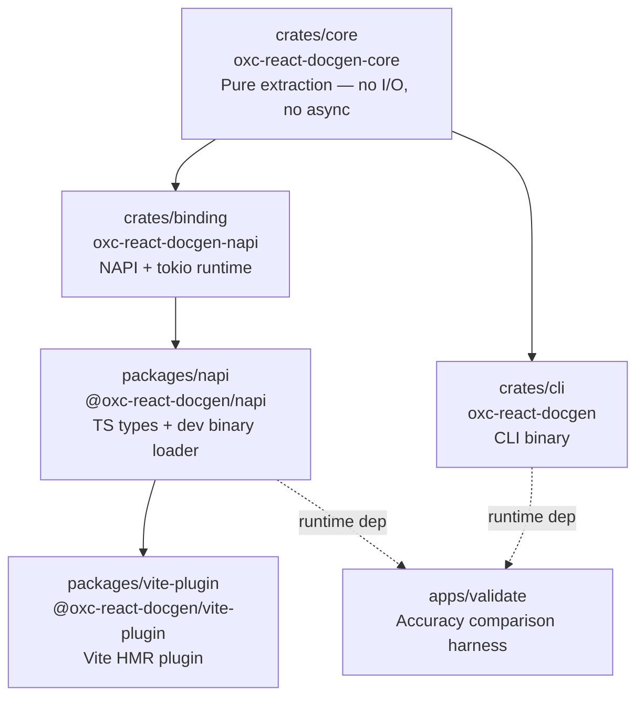

# Architecture

## Pipeline

Every extraction — cold or incremental — flows through four phases:

```mermaid
flowchart LR
    src["Source files\n.ts / .tsx / .d.ts"]
    oxc["OXC parser\none allocator per file"]
    sd["SourceData\ninterfaces, type aliases,\nimport bindings, defaults"]
    gsd["GlobalSourceData\nmerged across all files\nArc&lt;ArcSwap&lt;…&gt;&gt;"]
    ce["ComponentEntry\nresolved props,\ninheritance chain"]
    out["ExtractionOutput\nJSON-serializable"]

    src -->|"discover_files()\nignore crate"| oxc
    oxc -->|"parse_file()\nper-file parallel"| sd
    sd -->|"rayon par_iter\nmerge()"| gsd
    gsd -->|"resolve_component()\nper-component parallel"| ce
    ce -->|"pipeline::extract()"| out
```



Each `parse_file()` call gets its own OXC allocator. No AST node escapes the function — all extracted data is owned, heap-allocated types. This is what makes the rayon parallelism safe.

The watch path reuses `GlobalSourceData` across file changes. A single-file update calls `parse_file()` on the changed file, merges via `ArcSwap::rcu` (retries on concurrent write), then re-resolves only the affected components.

## Crate and package graph



`crates/core` has no dependency on async runtimes, NAPI, or terminal libraries. It can be linked from any host.

## Module layout

### `crates/core/src/`

```
types/
  collected.rs    — CollectedType, SourceData, RawProp, ImportBinding, LexedExport
  output.rs       — PropType, ComponentEntry, ExtractionOutput, InheritedLayer, ParsedProp
  diagnostic.rs   — Diagnostic, DiagnosticSeverity, DiagnosticCode
  global.rs       — GlobalSourceData, ScopedKey

extractor/
  mod.rs          — parse_file() entry point; SourceDataCollector struct
  visit.rs        — impl Visit for SourceDataCollector (AST walker)
  component.rs    — component pattern detection (FC, forwardRef, HOC, exotic)
  interface.rs    — collect_interface, collect_raw_props, collect_object_fields
  alias.rs        — classify_type_alias (Omit/Pick/Passthrough/Union/Intersection)
  jsdoc.rs        — find_jsdoc, extract_jsdoc_tags, parse_jsdoc_text
  defaults.rs     — extract_param_defaults from destructured function parameters

resolver/
  mod.rs          — resolve_component(); ResolutionContext; ResolveState (per-call)
  chain.rs        — resolve_props_chain, resolve_interface_chain
  extends.rs      — resolve_extends_ref
  alias.rs        — resolve_type_alias_chain, resolve_base_as_chain
  primitives.rs   — resolve_union, resolve_intersection, resolve_indexed_access
  collected.rs    — CollectedType → PropType dispatch
  named.rs        — resolve_named (main named-type lookup and import following)
  template.rs     — resolve_template_literal
  func.rs         — resolve_function_type, resolve_typeof
  import.rs       — resolve_to_canonical, resolve_import_specifier
  html.rs         — infer_html_attr_prop_type
  react.rs        — react_type_to_prop_type

pipeline/
  mod.rs          — extract(); PipelineOptions; resolution orchestration
  discover.rs     — discover_files (directory walk + gitignore via ignore crate)
  watch.rs        — WatchSession (ArcSwap + rayon for lock-free hot updates)

known.rs          — library shortcuts: SxProps, VariantProps, sx, css, cva, tv, defineRecipe…
react_types.rs    — React builtin recognition + notable HTML attribute table
import_map.rs     — import binding resolution
cache.rs          — DTS parse cache (mtime + size invalidation, msgpack, atomic write)
```

### `crates/cli/src/`

```
main.rs           — Cli struct, Command enum, main(), init_tracing()
config.rs         — docgen.config.ts loading via node+tsx (result discarded; next milestone)
output.rs         — print_summary, print_diagnostics, comfy-table helpers
commands/
  extract.rs      — cmd_extract (RDT / Storybook output)
  watch.rs        — cmd_watch (watchexec integration)
  inspect.rs      — cmd_inspect (single-file table view)
  check.rs        — cmd_check
  completions.rs  — shell completion generation
```

## Key types

### `CollectedType` — raw structural type from the extractor

The AST visitor produces `CollectedType` without doing any semantic resolution. It describes the structure of a TypeScript type as written, not what it means.

```
Named { name: "ButtonVariants", args: [] }
Union([Named { name: "string" }, Named { name: "undefined" }])
Intersection([Named { name: "ButtonHTMLAttributes", args: ["button"] }, Object([…])])
Omit { base: Named { name: "InputProps" }, keys: ["value"] }
```

### `PropType` — resolved semantic type for consumers

The resolver transforms `CollectedType` into `PropType`. This is the discriminated union that appears in `ExtractionOutput` and the TypeScript types package.

```
{ kind: "literalUnion", members: ["default", "destructive", "outline"], hasDefault: true }
{ kind: "eventHandler", eventType: "MouseEvent<HTMLButtonElement>" }
{ kind: "htmlAttributes", element: "button", omitted: [] }
{ kind: "opaque", raw: "ConditionalType<…>", reason: { type: "conditionalType" } }
```

### `ResolveState`

Created fresh for each `resolve_component()` call. Holds:
- Visited-type set for cycle detection (`FxHashSet<CompactString>`)
- Current recursion depth
- Accumulated diagnostics

Not shared between threads — rayon creates one per component.

### `GlobalSourceData`

The merged view across all parsed files: component declarations, type aliases, interface definitions, import bindings. Wrapped in `Arc<ArcSwap<…>>` for lock-free reads during parallel resolution. The watch session updates it with `rcu` (compare-and-swap with retry) when a file changes.

## Design decisions

### OXC instead of the TypeScript compiler

`react-docgen-typescript` creates a TypeScript `Program` — this loads all imported types transitively, runs type inference, and is single-threaded. `oxc-react-docgen` parses each file independently in parallel with no type-checking pass. The trade-off: TypeScript-only semantics (conditional types, `infer`, deep utility type evaluation) fall through to `{ kind: "opaque" }`. Everything structurally expressible — interfaces, intersections, unions, `Omit`, `Pick`, `VariantProps` — resolves correctly.

### `FxHashMap` over `HashMap`

OXC uses `FxHashMap` throughout. For short keys (type names, file paths) the FNV-derived hash in `rustc-hash` is faster than SipHash with no DoS-relevant surface for this use case.

### `CompactString` for type and prop names

Most names in the hot path (`string`, `boolean`, `ReactNode`, `MouseEvent`, `className`) are ≤24 bytes. `CompactString` stores them inline without heap allocation. Extraction visits thousands of names per file; this adds up.

### Manual `Serialize`/`Deserialize` for `CollectedType` and `PropType`

Both are deeply recursive enums. `#[derive(Serialize, Deserialize)]` hit Rust's monomorphization recursion limit during macro expansion, producing 19-minute compile times. Both now implement serialization manually through `serde_json::Value` as an intermediate, which breaks the recursion chain at the cost of one heap allocation per serialized value. A `#![recursion_limit = "2048"]` attribute is still present in `lib.rs` for other traits but is no longer load-bearing for these types.

### DTS cache location: `node_modules/.cache/`

`.d.ts` files from `node_modules` rarely change within a project session. The cache stores parsed `SourceData` keyed by file path, mtime, and size, serialized with msgpack and written atomically. `node_modules/.cache/` is the correct location: it is cleaned with `node_modules`, excluded from version control, and preserved across CI runs when `node_modules` is cached by layer.

### `hotUpdate` returns `undefined`, not `[]`

Vite's `hotUpdate` hook suppresses React Fast Refresh for a changed file if any plugin returns `[]` (empty module list). The plugin returns `undefined` to let both paths run: our metadata update fires, and React's HMR still re-renders the component. Returning `[]` is the more common pattern and the wrong one here.

### `BTreeMap` for JSON output maps

Component props and enums are serialized as `BTreeMap<String, …>` rather than `FxHashMap`. This gives stable key ordering across runs — important for snapshot tests, diffs, and downstream tools that consume the JSON.

## What is not yet implemented

| Feature | Status |
|---------|--------|
| Preset system (`@oxc-react-docgen/presets`) | Designed; no Rust changes needed — config-side only. |
| LSP server | `lsp-types` dep present; nothing implemented. |
| Conditional types (`T extends U ? X : Y`) | Emitted as `opaque` — needs a real type checker, see `docs/type-checker-integration.md`. |
| Mapped types with computed keys | Emitted as `opaque`. |

Config file loading and cross-package `.d.ts` resolution are both fully implemented — see `docs/STATUS.md` if you're checking whether an older doc's claim about either is still true.
